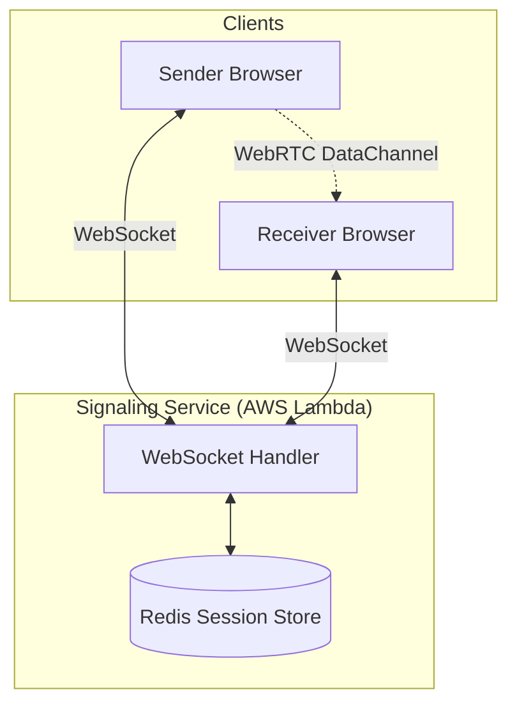
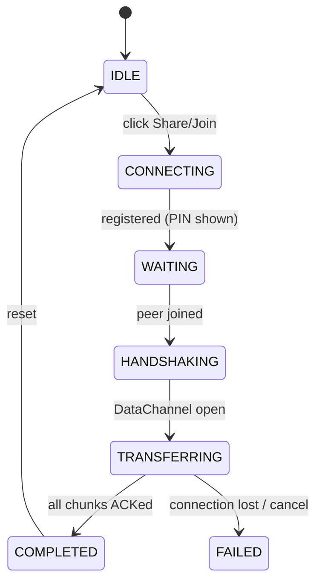
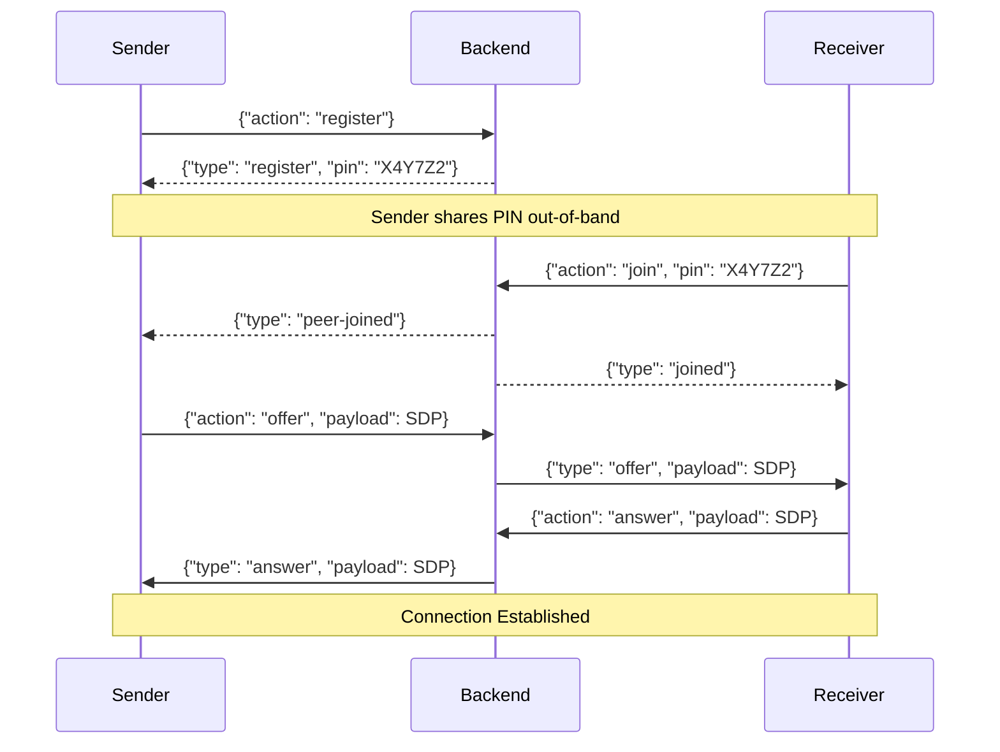

# FileShare Architectural Design

This document details the technical architecture, protocols and low-level design of the FileShare system.

---

## 1. High-Level Architecture (HLD)

FileShare uses a hybrid Peer-to-Peer architecture. A centralized signaling server facilitates discovery and connection establishment, while the actual data transfer happens directly between clients using WebRTC.



---

## 2. Low-Level Design (LLD)

### 2.1 Backend: Session & PIN Management

The backend is a stateless AWS Lambda function that uses Redis for cross-invocation state management.

#### PIN Generation
- **Logic**: Uses `SecureRandom` to generate a 6-character alphanumeric PIN.
- **Alphabet**: `ABCDEFGHJKLMNPQRSTUVWXYZ23456789` (excludes confusing characters like `I`, `O`, `0`, `1`).
- **Uniqueness**: The generator retries if a PIN collision is detected in Redis.

#### Redis Schema
| Key Pattern | Type | Purpose | TTL |
|:---|:---|:---|:---|
| `pin:{PIN}` | Hash | Stores `senderConnId` and `receiverConnId`. | 600s |
| `connection:{connId}` | String | Maps a connection ID back to its PIN for cleanup. | 600s |

### 2.2 Frontend: Transport Layer

The Transport layer is responsible for breaking files into packets and ensuring they arrive safely without overwhelming the receiver.

#### Binary Chunk Protocol
Each packet sent over the `RTCDataChannel` follows this binary format:
```text
[0-3]   chunkIndex    (uint32, big-endian)
[4-7]   payloadLength (uint32, big-endian)
[8-N]   payload       (raw bytes)
```
- **Chunk Size**: Hardcoded to **64KB** for maximum compatibility across browser engines.

#### Backpressure Mechanism (Sender)
To prevent the browser's SCTP buffer from overflowing:
1. **Thresholds**: 
   - `MAX_BUFFERED_AMOUNT`: 4MB
   - `LOW_THRESHOLD`: 512KB
2. **Flow**: If `bufferedAmount` > 4MB, the sender pauses and waits for the `bufferedamountlow` event before continuing.

#### Direct-to-Disk Streaming (Receiver)
The receiver uses the **FileSystem Access API** to handle large files (GigaBytes) without crashing the browser tab:
1. Upon metadata arrival, the receiver requests a file handle via `showSaveFilePicker`.
2. As chunks arrive, they are written to the `FileSystemWritableFileStream` using `.seek(position)`.
3. If the API is unavailable (e.g., Firefox/Safari), it falls back to in-memory `Blob` assembly.

### 2.3 State Machine: Transfer Lifecycle



---

## 3. Signaling Protocol

The signaling phase exchanges session descriptions (SDP) and ICE candidates.



---

## 4. Performance & Security

- **Encryption**: WebRTC provides mandatory DTLS encryption for the DataChannel.
- **Speed**: Optimized by minimal protocol overhead and binary framing; typically limited only by the user's upload bandwidth.
- **Privacy**: No file data is ever persisted or transmitted through the signaling server.
